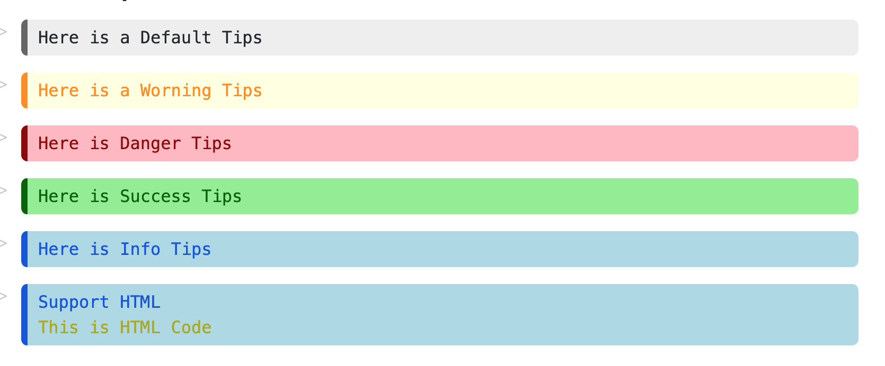
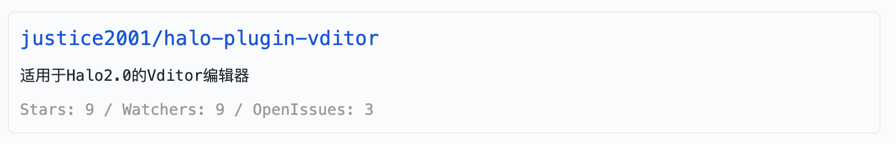

# Halo-Vditor语法介绍

> 当前halo-render还在测试中，halo-render也可以接入任何markdown编辑器中，
> 在维护过程中，我会尽量保证语法保持不变

[Halo-Vditor](https://git.mczhengyi.top/zhengyi/vditor)在原版
Vditor基础上添加了[HaloRender](https://git.mczhengyi.top/zhengyi/halo-render)
的支持，实现了部分适用于博客编写的拓展语法。

## 支持语法

Halo Vditor的基本语法规则为：

```markdown
    ```halo
    <类型>:<参数>
    <内容>
    ```
```

### 多彩Tips



语法:
```markdown
tips:<类型>
<内容>
```

类型可以是:

- `-` 不填写类型时默认为灰色
- `warn` 警告类型
- `danger` 危险类型
- `success` 成功类型
- `info` 提示类型

同时内容支持HTML文本，Render将不会对内容进行转译

**示例**

```markdown
tips:info
Support HTML
<div style="color: #aaaa00;">This is HTML Code</div>
```

### Git仓库

Git 仓库功能可以在页面上为用户展示仓库的信息。该功能暂时仅支持
Github仓库，后续会添加对gitea、gitee的支持。



语法:

```markdown
git:[<网址>@<平台>/<所有者>/<仓库>]
```

- `网址` 保留功能。
- `平台` 当前版本仅支持github

> 当使用github平台时无需填写网址，但要保留@符号

**示例**

```markdown
git:[@github/justice2001/halo-plugin-vditor]
```